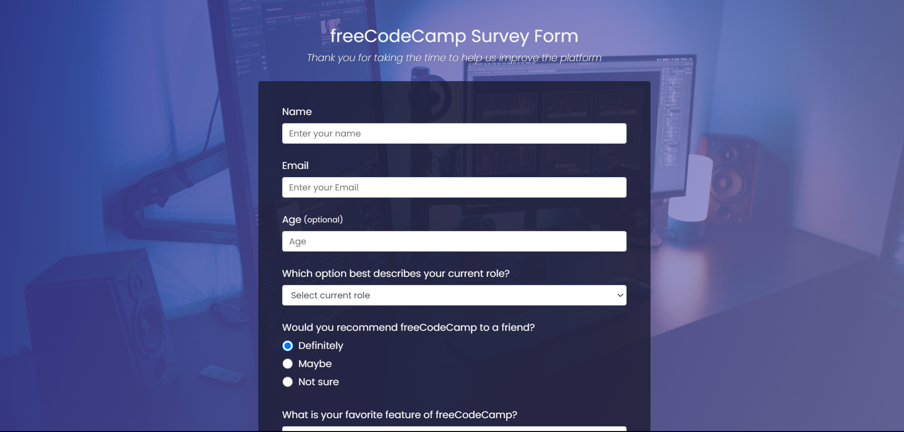

# 📝 surveyForm
​
Welcome to the **Survey Form** repository! This project consists of a simple and responsive survey form, developed with **HTML5** and **CSS3**. The goal is to practice creating accessible and visually pleasing forms, essential for collecting user feedback on websites and web applications.

## Layout

    

## 📋 Features

- **Survey Form:** Includes fields for name, email, age, multiple choice options, and a comment text area, allowing users to provide detailed feedback.

- **Responsive Layout:** Adapts to different screen sizes, ensuring a good experience on mobile devices and desktops.

- **Clean and Intuitive Design:** Uses a soft color palette and legible typography to make it easy to read and navigate.​

## 🛠️ Technologies Used
- **HTML5**: Semantic structuring of the page content.

- **CSS3**: Responsive styling and layout of the form.​
